<!-- Converted from Word (.docx) to Markdown.
This file intentionally keeps some HTML tags/styles inside Markdown to preserve Word-like formatting: font size, colors, indentation, numbering, bullets, bold/underline, and image dimensions. -->

<b>QUY
TRÌNH CA TẬP TRUNG</b>

<ol>
<li>
<b>QUY
	TRÌNH VẬN HÀNH HỆ THỐNG CA TẬP TRUNG</b>

<ol>
<li>
<b>Quy
		trình quản lý máy chủ Esxi</b>
</li>
<li>
<b>Quy
		trình dựng máy chủ Esxi</b>
</li>
<li>
<b>Quy
		trình quản lý và backup máy ảo Esxi</b>
</li>
</ol>
<li>
<b>QUY
	TRÌNH THỰC HIỆN DỰ ÁN CA TẬP TRUNG</b>
</li>
</li></ol>

Đối với dự án CA áp dụng phương pháp CA tập trung sẽ
bao gồm các bước sau:

<ul>
<li>
Khởi tạo
	tài liệu, công cụ cho dự án (1)
</li>
<li>
Thu thập
	log cho dự án (2)
</li>
<li>
Tiền xử
	lý log (3)
</li>
<li>
Tiến hành
	hunting tập trung (4)
</li>
<li>
Đánh giá
	lại hiệu năng và cải tiến (5)
</li>
</ul>

 
 

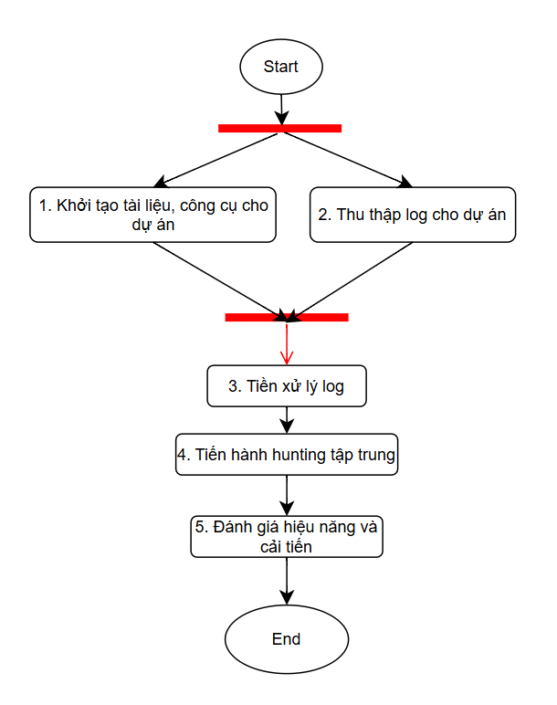

 
 

<ol>
<ol>
<li>
<b>Khởi
		tạo tài liệu cho dự án</b>
</li>
</ol>
</ol>

Hiện tại các
dự án CA đang sử dụng các file Excel (.xlsx) để quản lý
thông tin. Hiện tại tài liệu này sẽ áp dụng quy trình
với các file Excel

VSEC đang phát
triển hệ thống DFIR Platform hỗ trợ quản lý note cho
hunting tập trung và áp dụng trong thời gian sớm nhất
(khoảng tháng 04/2026). Sau khi app dụng DFIR Platform sẽ cập
nhật thêm quy trình sử dụng hệ thống này. 

<ol>
<ol>
<ol>
<li>
Tạo
			Centrailzed Hunting Note
</li>
</ol>
</ol>
</ol>

Tạo các File
exel từ template như hình sau: 

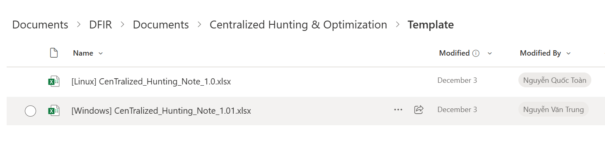

Template có
trong sharepoint DFIR với đường dẫn: 

<u>Documents
&gt; DFIR &gt; Documents &gt; Centralized Hunting &amp; Optimization
&gt; Template</u>

Link: <u><a href="https://vsecvn.sharepoint.com/sites/HuntingDFIR/Shared%20Documents/Forms/AllItems.aspx?id=%2Fsites%2FHuntingDFIR%2FShared%20Documents%2FDFIR%2FDocuments%2FCentralized%20Hunting%20%26%20Optimization%2FTemplate&amp;viewid=7595e775%2De694%2D4192%2Db623%2Dcb73bfbc7c26&amp;ct=1739255796584&amp;or=Teams%2DHL&amp;ga=1&amp;LOF=1">Link</a></u>

Copy vào thư
mục của dự án tương ứng. Ví dụ: 

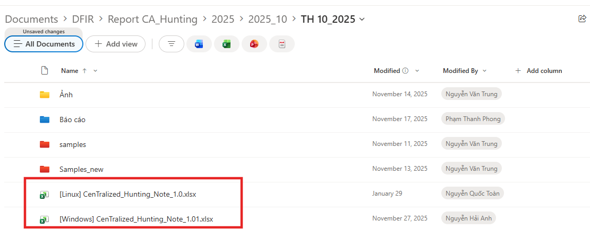

Các
file này sẽ được sử dụng 

 
 

<ol>
<ol>
<ol start="2">
<li>
Tạo
			dự án trên DFIR Platform (To be determined)
</li>
</ol>
<li>
<b>Thu
		thập log và thông tin thiết bị cho dự án</b>

<ol>
<li>
<b>Thu
			thập log từ endpoint</b>
</li>
<li>
<b>Copy
			log vào máy chủ Hunting tập trung</b>
</li>
</ol>
</li></ol>
</ol>

<ol type="a">
<li>
Truy
	cập vào máy chủ hunting tập trung
</li>
</ol>

<ul>
<li>
IP
	Address: 10.15.4.241 (có thể thay đổi trong tương lai, xem
	mới nhất trong teams)
</li>
<li>
Username:
	theo tên thành viên, ví dụ toannq, phongpt,…
</li>
<li>
Password:
	&lt;được cấp riêng&gt;
</li>
</ul>

<ol start="2" type="a">
<li>
Tạo
	thư mục log
</li>
</ol>

Cần tạo 2 thư mục tương
ứng cho Raw Logs (chưa giải nén) và thư mục chứa log đã
giải nén và đã tiền xử lý

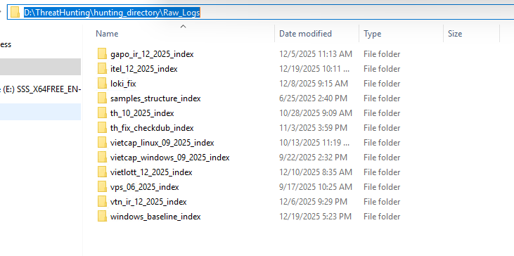

<ul>
<li>
Truy
	cập vào D:\ThreatHunting\hunting_directory\Raw_logs
</li>
<li>
Tạo
	thư mục mới cho dự án, clone từ thư mục
	samples_structure_index
</li>
<li>
Lưu
	ý: tên thư mục cho dự án theo format: &lt;tên
	KH&gt;_&lt;month&gt;_&lt;year&gt;_index (1)
</li>
</ul>

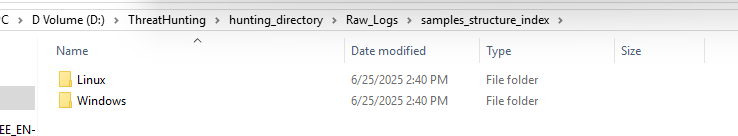

<u>Lưu ý:</u>
cần copy chính xác loại log của Windows và Linux vào thư
mục tương ứng

 
 

<ol start="3" type="a">
<li>
Tạo
	thư mục chứa log giải nén và tiền xử lý
</li>
</ol>

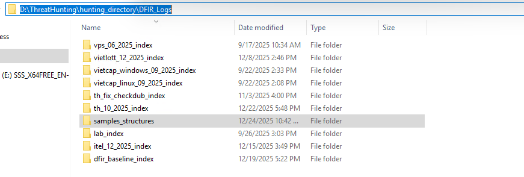

<ul>
<li>
Truy
	cập vào D:\ThreatHunting\hunting_directory\DFIR_Logs
</li>
<li>
Tạo
	thư mục mới cho dự án, clone từ thư mục
	samples_structures
</li>
</ul>

Lưu ý:
tên thư mục cho dự án theo format: &lt;tên
KH&gt;_&lt;month&gt;_&lt;year&gt;_index Tên phải giống (1)

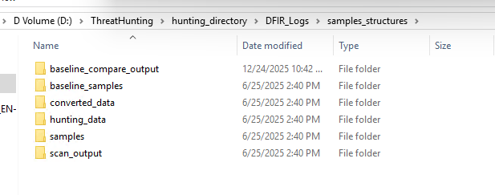

<ul>
<li>
Cấu
	trúc thư mục dự án trong DFIR_Logs:

<ul>
<li>
baseline_compare_ouput:
		chứa log đã so sánh với baseline
</li>
<li>
baseline_samples:
		chứa các sample log của host baseline
</li>
<li>
converted_data:
		chứa log đã tiền xử lý, được đẩy lên Splunk
</li>
<li>
hunting_data:
		chứa dữ liệu tiền xử lý riêng cho Linux hunting trên
		Portal
</li>
<li>
samples:
		chứa các thư mục log được giải nén từ Raw_Logs tương
		ứng
</li>
<li>
scan_output:
		chứa các kết quả scan (thông tin máy, trạng thái
		webshell, kết quả scan thor,…)
</li>
</ul>
</li></ul>

<ol>
<ol>
<ol start="3">
<li>
<b>Kiểm
			tra log</b>
</li>
</ol>
</ol>
</ol>

Trước khi hoàn
thành quá trình thu thập log, cần kiểm tra kỹ lưỡng các
log đã thu thập.

Để phát hiện
các trường hợp lỗi như:

<ul>
<li>
Tool thu
	thập log chưa chạy xong
</li>
<li>
Tool đã
	chạy xong tuy nhiên thiếu log
</li>
<li>
Tool thu
	thập webshell đã chạy xong nhưng không phát hiện được
	webroot
</li>
<li>
Tool bị
	dừng sớm do hết thời gian timeout
</li>
<li>
vv…
</li>
</ul>

Có 2 cách để
kiểm tra log

<ul>
<li>
Sử dụng
	Jenkins job: Windows – Audit Missing Sample Log 
	
</li>
<li>
Sử dụng
	công cụ .exe tự phát triển (áp dụng cho 1 log bất kỳ,
	không ưu tiên sử dụng cho hunting tập trung – yêu cầu
	tính nhất quán cao)
</li>
</ul>

Hướng dẫn sử
dụng Jenkins job:

<ul>
<li>
Truy cập
	job tại đường dẫn:
</li>
<li>

</li>
</ul>

<ol>
<ol>
<ol start="4">
<li>
<b>Thu
			thập thông tin thiết bị cho dự án</b>
</li>
</ol>
</ol>
</ol>

Sau khi thu thập
log cần 

<ol type="I">
<ol>
<li>
<b>Tiền
		xử lý log và upload Splunk</b>
</li>
</ol>
</ol>

Dữ liệu đã
được chuẩn bị chính xác cho dự án ở bước 2.2.2

Tiếp theo sẽ
sử dụng <b>Jenkins</b> để chạy các công cụ tiền xử
lý thông qua các Job được cài đặt sẵn

<ol>
<ol>
<ol>
<li>
<b>Tiền
			xử lý log cho Windows</b>
</li>
</ol>
</ol>
</ol>

<ul>
<li>
Truy cập
	vào Jenkins tại địa chỉ: <u><a href="http://10.15.4.241/jenkins">http://10.15.4.241/jenkins</a></u>
</li>
<li>
Truy cập
	job <b>Windows - Process and Upload to Splunk: </b><u><a href="http://10.15.4.241/jenkins/job/Windows%20Centralized%20Hunting/job/Windows%20-%20Process%20and%20Upload%20to%20Splunk/"><b>link</b></a></u>
</li>
<li>
Chọn Build
	with Parameters
</li>
</ul>

 
 

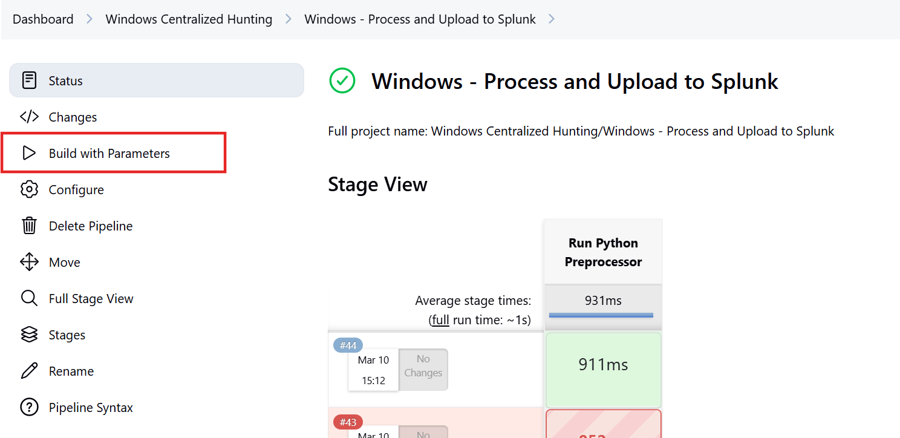

<ul>
<li>
Nhập/chọn
	các parameters
</li>
</ul>

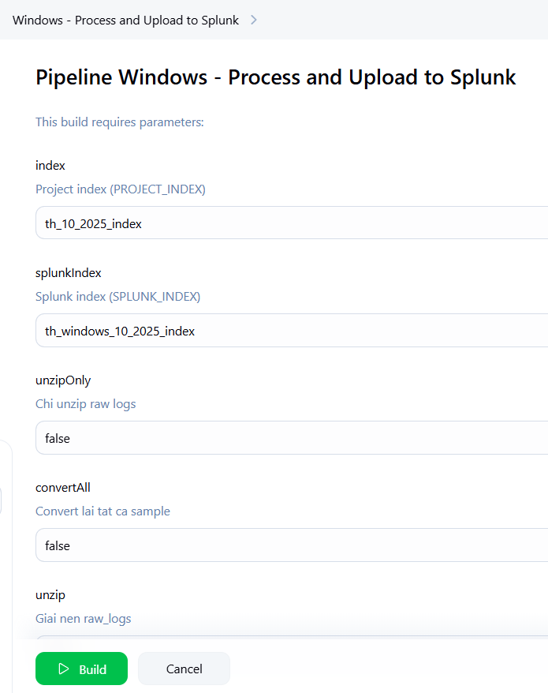

Các parameters:

<ul>
<li>
index:
	tên index của dự án, trùng với (1) và (2)
</li>
<li>
splunkIndex:
	index của dự án trên Splunk (3)
</li>
<li>
unzip:
	có giải nén log từ Raw_Logs qua DFIR_Logs hay không
</li>
<li>
unzipOnly:
	true nếu chỉ muốn unzip chứ không tiền xử lý
</li>
<li>
unzipReplace:
	có giải nén lại những sample đã giải nén không
</li>
<li>
convertAll:
	có tiền xử lý ghi đè lại tất cả sample đã tiền xử
	lý, true khi có update về log
</li>
<li>
compareBaseline:
	có compare với baseline hay không
</li>
<li>
uploadToSplunk:
	true nếu muốn upload lên Splunk, false nếu chỉ tiền xử
	lý
</li>
</ul>

<ul>
<li>
Chọn
	Build để bắt đầu chạy tool tiền xử lý
</li>
<li>
Xem
	kết quả Build
</li>
</ul>

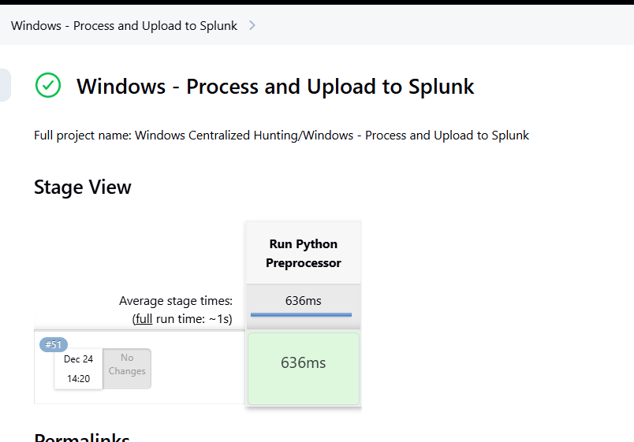

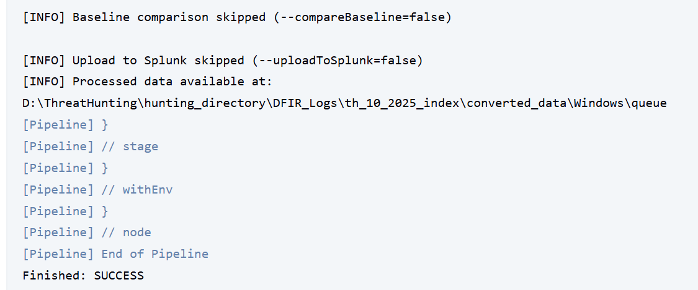

<ol>
<ol>
<ol start="2">
<li>
<b>Tiền
			xử lý log cho Linux</b>
</li>
</ol>
</ol>
</ol>

<ul>
<li>
Truy cập
	vào Jenkins tại địa chỉ: <u><a href="http://10.15.4.241/jenkins">http://10.15.4.241/jenkins</a></u>
</li>
<li>
Truy cập
	thư mục job <b> Linux Centralized Hunting
	</b>

</li>
</ul>

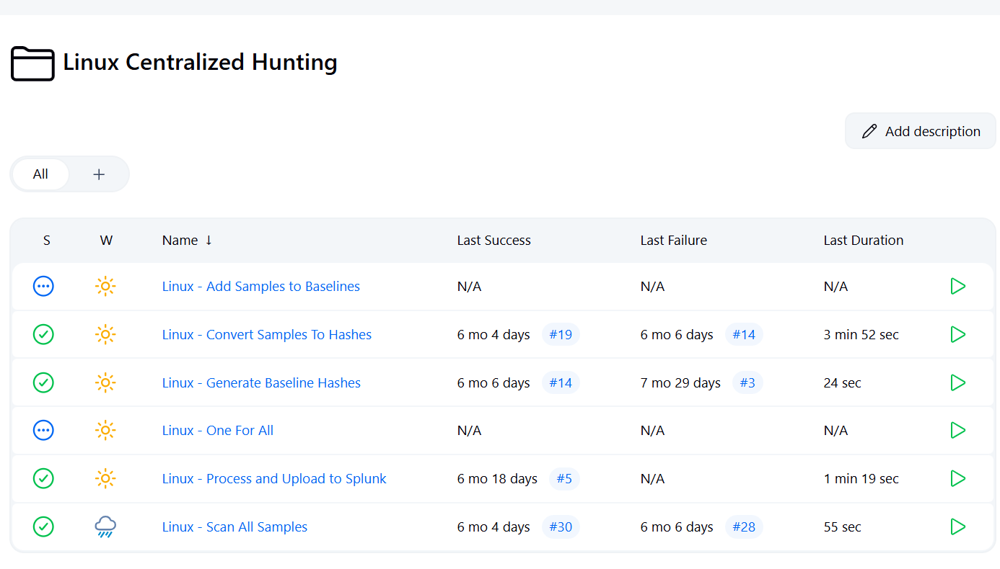

<ul>
<li>
Chạy
	các job bên trong theo thứ tự sau:

<ul>
<li>
<u><a href="http://10.15.4.241/jenkins/job/Linux%20Centralized%20Hunting/job/Linux%20-%20Convert%20Samples%20To%20Hashes/">Linux
		- Convert Samples To Hashes</a></u>:
		Convert sample thành hash
</li>
</ul>
</li></ul>

 
 

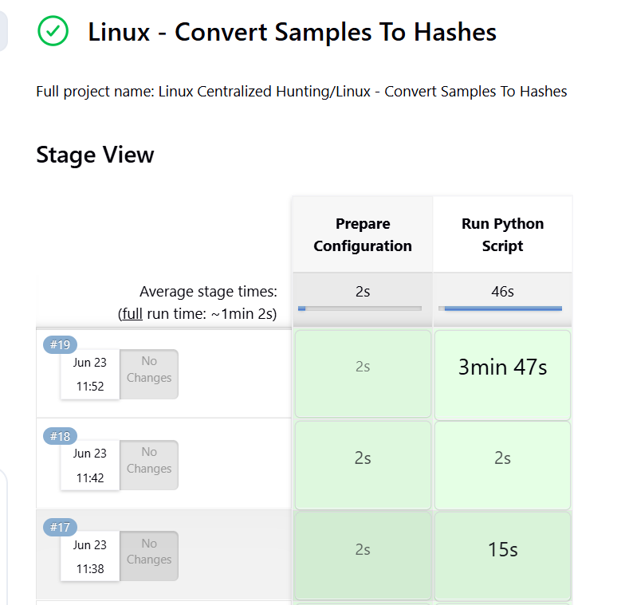

<ul>
<ul>
<li>
<u><a href="http://10.15.4.241/jenkins/job/Linux%20Centralized%20Hunting/job/Linux%20-%20Generate%20Baseline%20Hashes/">Linux
		- Generate Baseline Hashes</a></u>:
		convert các baseline thành hash
</li>
</ul>
</ul>

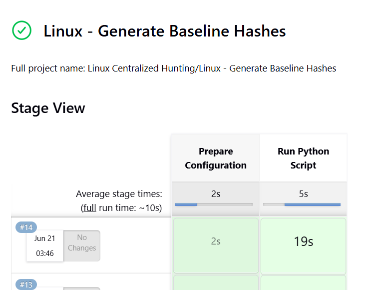

<ul>
<ul>
<li>
<u><a href="http://10.15.4.241/jenkins/job/Linux%20Centralized%20Hunting/job/Linux%20-%20Scan%20All%20Samples/">Linux
		- Scan All Samples</a></u>:
		scan tất cả các sample với baseline
</li>
</ul>
</ul>

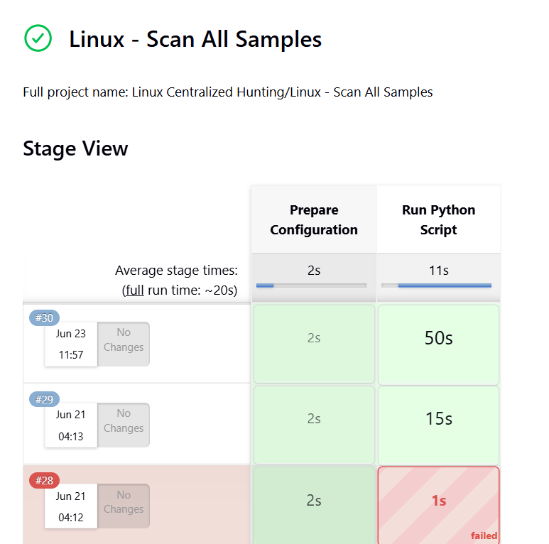

<ol>
<ol>
<ol start="3">
<li>
<b>Kiểm
			tra log upload Splunk</b>
</li>
</ol>
</ol>
</ol>

Sau khi tiền xử
lý và upload log lên Splunk, cần kiểm tra kỹ lưỡng log đã
được đẩy thành công, chính xác lên Splunk chưa. Nếu
thiếu log sẽ dẫn đến việc rà soát thiếu.

Sử dụng query
Splunk để kiểm tra số lượng event được đẩy lên
Splunk và số lượng event từ raw log có tương đồng hay
không.

<ul>
<li>
Kiểm tra
	log Windows sử dụng query tại: <u><a href="https://gitlab.vsec.com.vn/dfir/hunting-group/dfir-platform/centralized-threat-hunting-usecases/-/blob/master/Windows/0.%20Check%20event%20count/queries.md?ref_type=heads">Queries</a></u>
</li>
</ul>

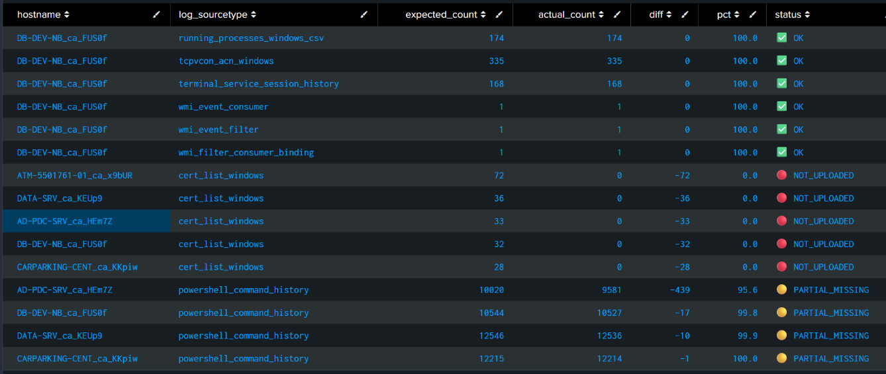

<ul>
<li>
Kiểm tra
	log Linux sử dụng query tại: <u><a href="https://gitlab.vsec.com.vn/dfir/hunting-group/dfir-platform/centralized-threat-hunting-usecases/-/blob/master/Linux/0.%20Check%20event%20count/queries.md?ref_type=heads">Queries</a></u>
</li>
</ul>

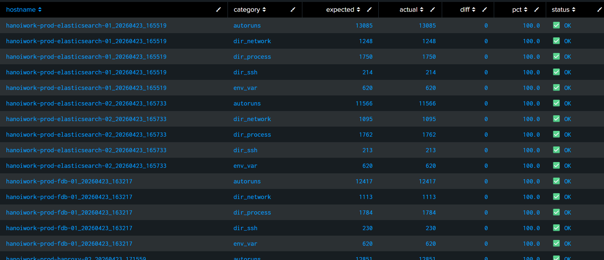

 
 

<ol>
<ol start="4">
<li>
<b>Tiến
		hành hunting tập trung</b>
</li>
</ol>
</ol>

Sau khi dữ liệu
và log được xử lý thành công, tiến hành hunting tập
trung

Hunting tập
trung sẽ chia ra Hunting tập trung cho Windows và Linux

Trong đó:

<ul>
<li>
Windows:
	hunting dựa trên query trên <b>Splunk</b>
</li>
<li>
Linux: hunting
	kết hợp <b>Splunk</b> và công cụ <b>Hunting Portal</b>
</li>
</ul>

Các công cụ
sử dụng:

<ul>
<li>

<u><a href="https://app.clickup.com/90181015141/v/o/s/90183617331">DFIR
	Hunting Checklist Clickup</a></u>: hỗ trợ tracking tiến
	độ, assign công việc và tính hiệu quả công việc của
	<b>hunting trên Splunk</b>
</li>
<li>

<u><a href="http://10.15.4.241/hunting/hunting-logsource">DFIR
	Hunting Portal</a></u>: hỗ trợ hunting các checklist
	manual của Linux và hunting compare Linux, hunting cho webshell,
	note envidence,….
</li>
<li>

<u><a href="http://10.15.4.241:8000/en-GB/app/search/search">Splunk
	Web</a></u>: thực hiện các truy vấn hunting tập
	trung theo usecase/log type
</li>
<li>

<u><a href="https://github.com/ToanElNino/Centralize-Threat-Hunting-Usecases">Hunting
	usecases</a></u>: chứa các câu query hunting tập trung
	cho Linux và Wndows
</li>
</ul>

 
 

<ol>
<ol>
<ol>
<li>
<b>Hunting
			tập trung cho Windows</b>
</li>
</ol>
</ol>
</ol>

Hunting tập
trung cho Windows sẽ dựa trên việc hunting theo từng usecase
cho các loại sourcetype

Ví dụ 1 số
loại sourcetype: 

<ul>
<li>
autoruns: từ
	log_autoruns.csv
</li>
<li>
dll_scan: từ
	dll.csv
</li>
<li>
prefetch_windows:
	tiền xử lý từ danh sách các file .pf
</li>
<li>
check_iis_module:
	tiền xử lý từ danh sách các file web.config của IIS
	webroot
</li>
</ul>

<ol type="a">
<li>
Quản lý
	tiến độ hunting theo checklist
</li>
</ol>

<ul>
<li>
Tạo
	Clickup folder cho dự án tương ứng
</li>
</ul>

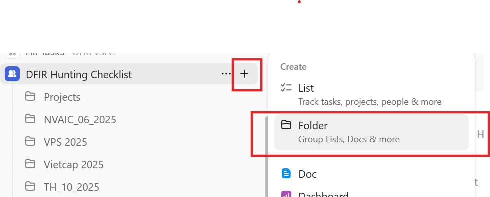

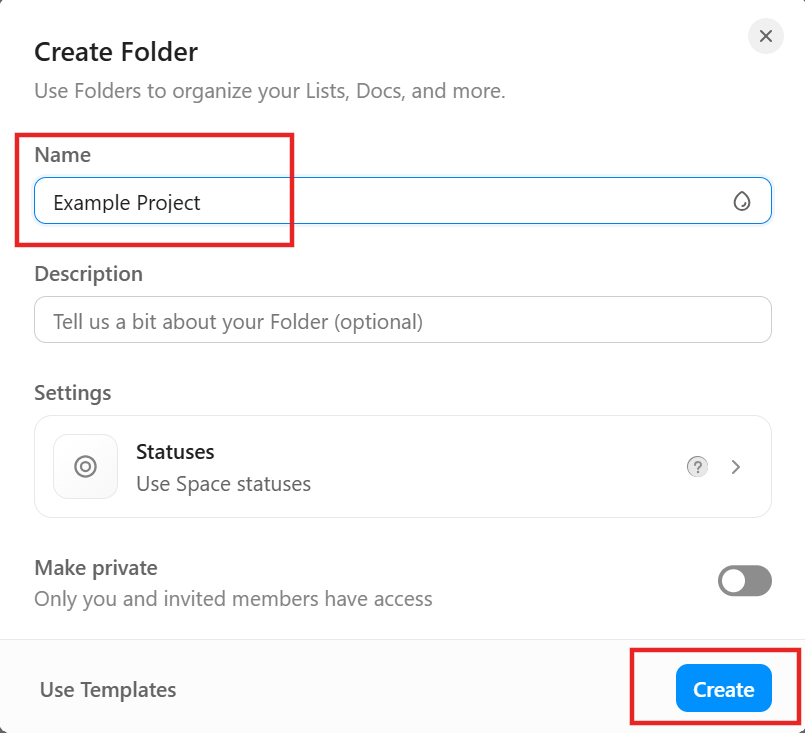

<ul>
<li>
Tạo
	Checklist hunting windows cho dự án trong thư mục vừa tạo
</li>
</ul>

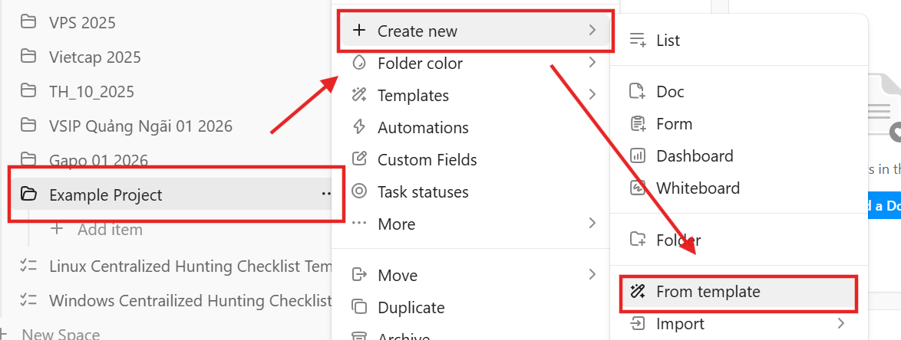

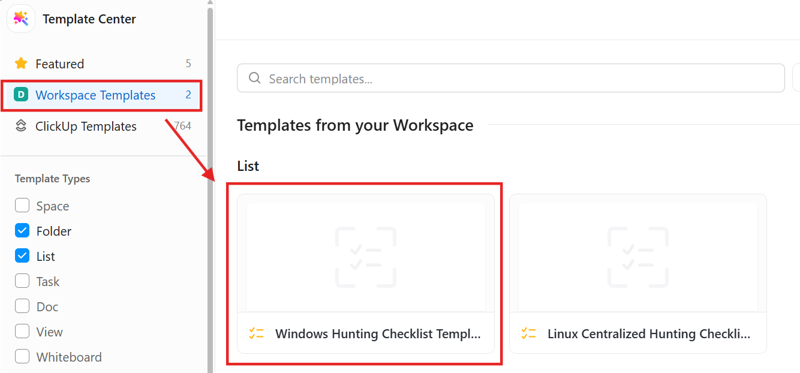

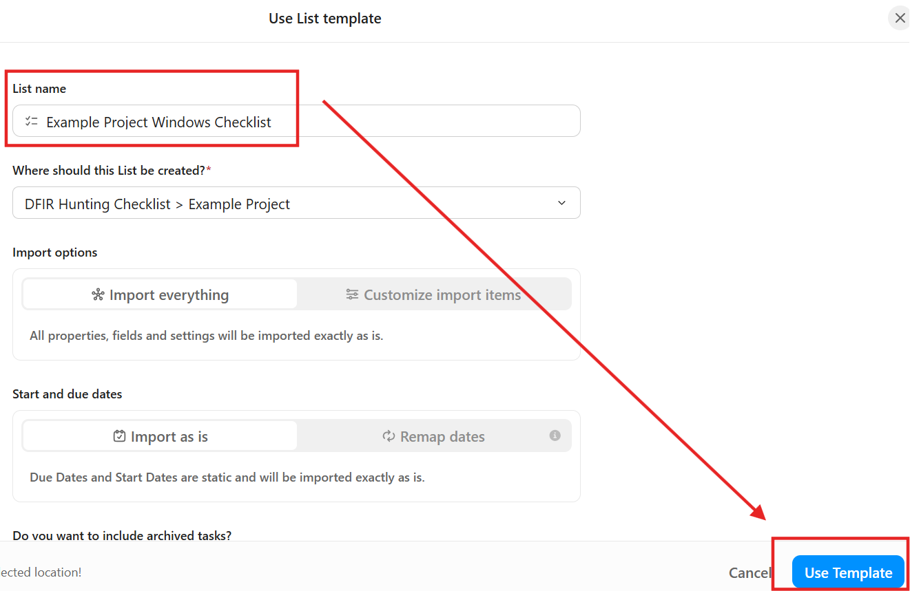

Checklist sẽ được tạo trong folder như hình dưới:

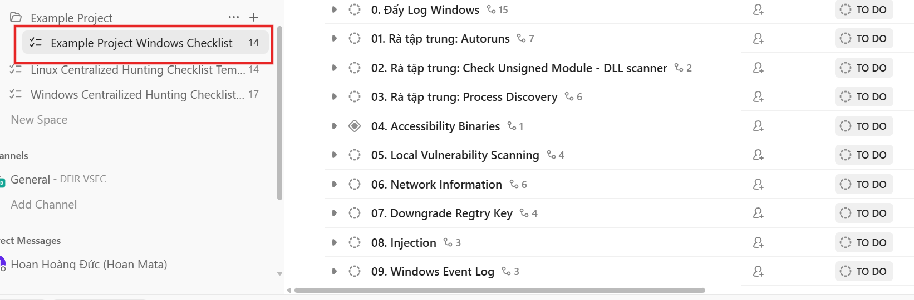

<ul>
<li>
Assign task
	cho member
</li>
</ul>

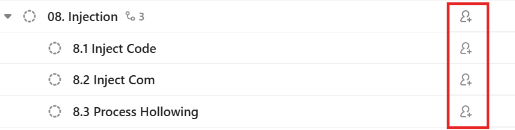

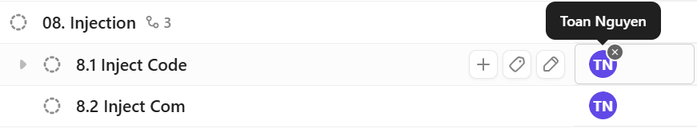

<ul>
<li>
Bắt đầu
	cho từng checklist
</li>
</ul>

Khi bắt đầu hunting từng checklist cần chuyển status sang
<b>IN PROGRESS </b>và <b>bấm thời gian</b> cho task (sẽ là dữ
liệu quan trọng để đánh giá hiệu năng và cải tiến)

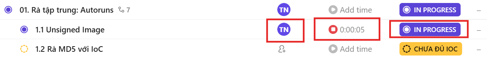

Note: chỉ cần bấm time cho sub-task, task
lớn sẽ tự tính tổng thời gian

<ul>
<li>
Query
	hunting cho checklis trên <b>Splunk</b>
</li>
</ul>

Ví dụ: <b>1.1 Unsignged Image</b>, query sẽ có trong
<u><a href="https://github.com/ToanElNino/Centralize-Threat-Hunting-Usecases/blob/master/Windows/1.%20Autoruns/1.1%20Unsigned%20Image/queries.md">Centralize-Threat-Hunting-Usecases/Windows/1.
Autoruns/1.1 Unsigned Image/queries.md</a></u>

 
 

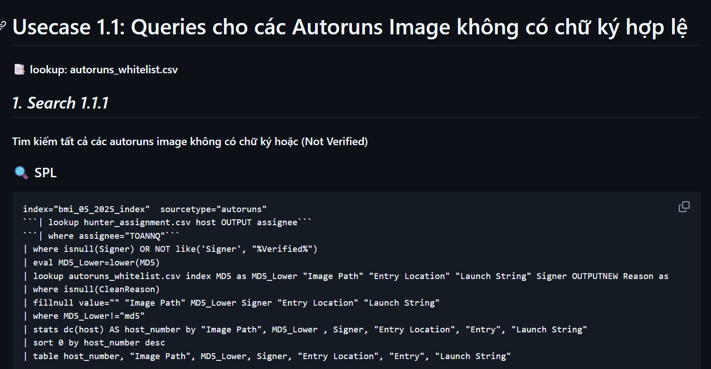

Sử dụng Query để search trên Splunk

Note: Đổi index chính xác theo splunk
index (3) tiền xử lý ở bước 2.3.1. Tiền xử lý log cho
Windows

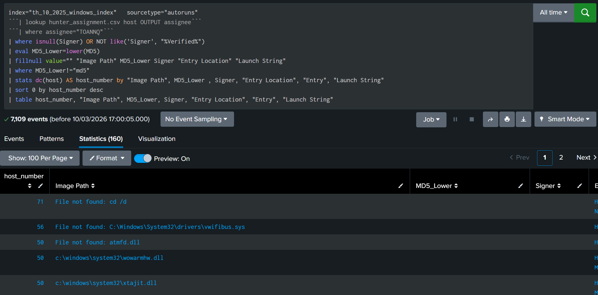

<ul>
<li>
Hoàn thành
	một checklist
</li>
</ul>

Chuyển status sang <b>DONE</b> và <b>stop timer</b>

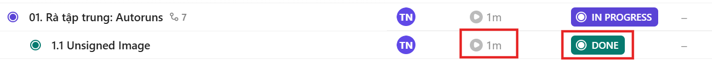

 
 

<ol>
<ol>
<ol start="2">
<li>
<b>Hunting
			tập trung cho Linux</b>
</li>
</ol>
</ol>
</ol>

 
 

 
 

<ol>
<ol start="5">
<li>
<b>Đánh
		giá hiệu năng và cải tiến</b>

<ol>
<li>
<b>Thu
			thập và đánh giá hiệu năng</b>
</li>
<li>
<b>Hướng
			dẫn contribute vào Usecase hunting</b>
</li>
<li>
<b>Hướng
			dẫn contribute vào DFIR Platform</b>
</li>
</ol>
</li></ol>
</ol>

 
 

